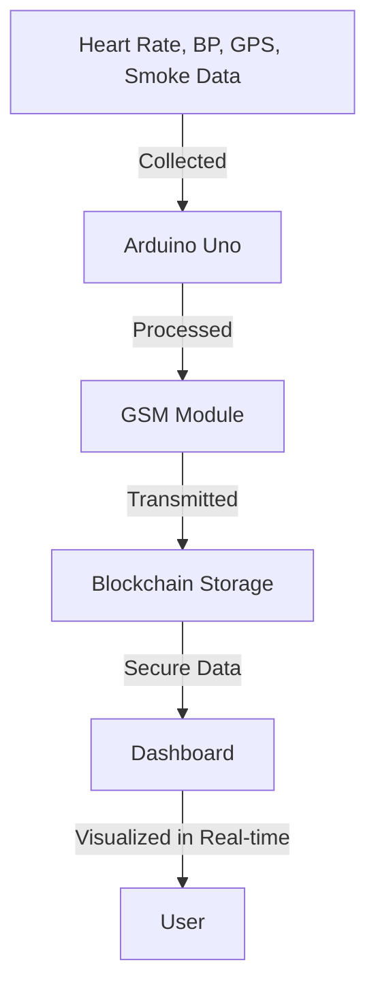

# Eagle Eye 🔥

  

**Eagle Eye** is a cutting-edge IoT-based surveillance and monitoring system designed to ensure real-time tracking of vital parameters, enhancing safety and situational awareness. This project integrates IoT hardware with blockchain for secure data storage and accessibility.

---

## 🚀 Features

- **Real-Time Monitoring**: Constant tracking of heart rate and blood pressure.
- **Location Tracking**: GPS module for real-time location updates.
- **Secure Data Storage**: Leveraging blockchain technology for tamper-proof data.
- **Integrated Sensors**: Smoke detection, temperature, and humidity monitoring.
- **Communication Modules**: GSM for remote data transfer.
- **Intuitive Interface**: Accessible backend interface for data visualization.

---

## 🛠️ Tech Stack

### **Hardware**
- **Microcontroller**: Arduino Uno
- **Sensors**:
  - Blood Pressure and Pulse Sensor (TG621K)
  - DHT11 (Temperature and Humidity Sensor)
  - MQ2 (Smoke Sensor)
- **Communication Modules**:
  - SIM900A (GSM)
  - GPS Module

### **Software**
- **Backend**:
  - Node.js for server-side logic
  - Blockchain integration using Remix
- **Frontend**:
  - React.js with Vite for performance
  - Real-time dashboards for parameter visualization

---

## 🔧 Installation

Follow the steps to get started:

1. **Clone the Repository**:
   ```bash
   git clone https://github.com/Pragat2021/eagle-eye.git
   cd eagle-eye
   ```

2. **Install Dependencies**:
   ```bash
   npm install
   ```

3. **Start the Backend Server**:
   ```bash
   node server.js
   ```

4. **Launch the Frontend**:
   ```bash
   npm run dev
   ```

5. **Hardware Setup**:
   - Connect the Arduino Uno to the sensors and communication modules as per the circuit diagram.
   - Upload the provided Arduino sketch.

---

## 📊 Data Flow Diagram



---

## 🤝 Contributing

We welcome contributions to make **Eagle Eye** even better. To contribute:

1. Fork the repository.
2. Create a feature branch:
   ```bash
   git checkout -b feature-name
   ```
3. Commit your changes:
   ```bash
   git commit -m 'Add some feature'
   ```
4. Push to the branch:
   ```bash
   git push origin feature-name
   ```
5. Open a Pull Request.

---

## 📝 License

This project is licensed under the MIT License - see the [LICENSE](LICENSE) file for details.

---

## 🌟 Acknowledgments

- [Arduino](https://www.arduino.cc/) for the hardware support.
- [Remix](https://remix.ethereum.org/) for blockchain integration.
- Open-source libraries and tools that made this project possible.

---

## 📷 Screenshots

### Dashboard Overview


### Hardware Setup


---

## 💬 Feedback

Have feedback or suggestions? Feel free to reach out:
- **Email**: [pragatshukla11@gmail.com](mailto:pragatshukla11@gmail.com)
- **GitHub**: [Pragat2021](https://github.com/Pragat2021)

---

### Made with ❤️ by Pragat Shukla and the Eagle Eye Team.
